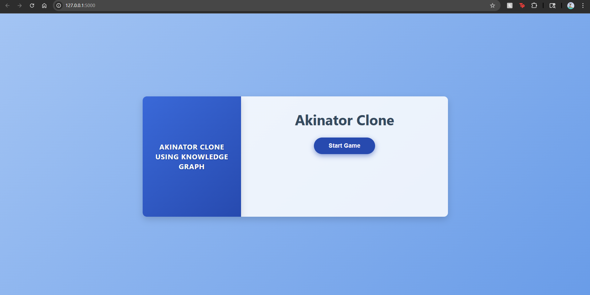
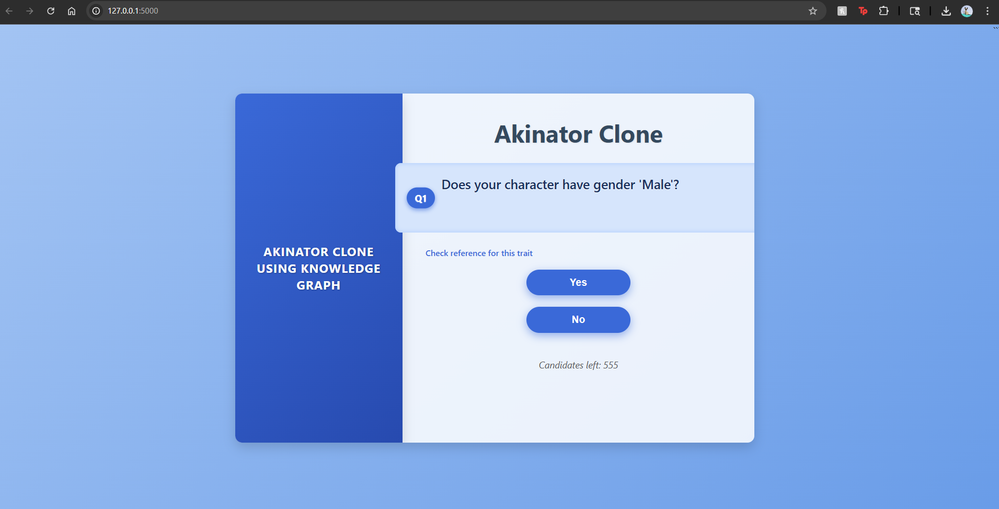
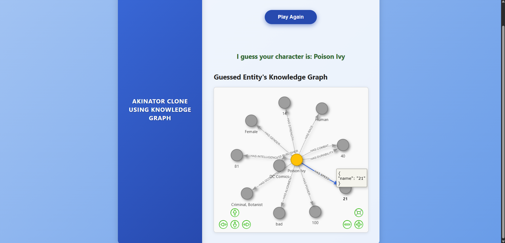

# Akinator Clone Using Knowledge Graph 🧙‍♂️🧠

---

## Project Overview

This project is an **Akinator-like guessing game** built on the foundation of a **knowledge graph**. It aims to replicate the popular game where a genie (or an AI in this case) guesses a character, object, or person by asking a series of yes/no questions. The core intelligence of this clone lies in its use of a **Neo4j knowledge graph** to store entities (e.g., superheroes) and their associated properties and relationships. The game logic traverses this graph, asking strategic questions to narrow down the possibilities and arrive at a final guess. The project includes components for data preprocessing, loading data into Neo4j, and a web-based user interface for interaction.

---

## Features

* **Interactive Guessing Game**: Play Akinator directly in your web browser.
* **Knowledge Graph Powered Logic**: Utilizes a Neo4j graph database for efficient and intelligent guessing based on interconnected data.
* **Extensible Data**: Easily add new characters/entities and their properties to the knowledge graph via CSV input.
* **Web-based Interface**: Simple and intuitive user interface for playing the game.
* **Modular Design**: Separated components for game logic, database interaction, and preprocessing.

---

## Technologies Used

* **Neo4j**: The primary graph database used for storing the knowledge base and powering the guessing logic.
* **Python**: The main programming language for backend logic, game rules, and database interactions.
* **Jupyter Notebook**: For data preprocessing, exploration, and loading data into the knowledge graph (`AKINATOR_CLONE_PREPROCESS.ipynb`).
* **HTML**: For structuring the web-based user interface (`index.html`).
* **Flask / Streamlit (Inferred from `app.py`)**: Likely used as the web framework to serve the HTML and handle game requests.
* **CSV**: For initial input of entities and their relationships (`superhero_triples.csv`).
* **Py2neo / Neo4j Driver (Likely in `conn.py`, `neo4j_loader.py`, `neoj4_utils.py`)**: Python libraries for interacting with Neo4j.

---
## Screenshots

Add screenshots of your Akinator clone here to give users a visual understanding of the game.

| Game Start Screen | Question & Answer Interface | Final Guess Screen |
| :----------------- | :-------------------------- | :----------------- |
|  |  |  |
| *The initial welcome screen.* | *A typical question from the system.* | *The system's final guess.* |

---
## Getting Started

Follow these steps to set up and run the Akinator clone locally.

### Prerequisites

* Python 3.x
* Pip (Python package installer)
* **Neo4j Desktop** or a running **Neo4j database instance**.
* Basic understanding of Neo4j Cypher queries is a plus.

### Installation

1.  **Clone the repository:**
    ```bash
    git clone [https://github.com/Shaun-Roy/AKINATOR-CLONE-USING-KNOWLEDGE-GRAPH.git](https://github.com/Shaun-Roy/AKINATOR-CLONE-USING-KNOWLEDGE-GRAPH.git)
    cd AKINATOR-CLONE-USING-KNOWLEDGE-GRAPH
    ```

2.  **Create a virtual environment (recommended):**
    ```bash
    python -m venv venv
    source venv/bin/activate  # On Windows use `venv\Scripts\activate`
    ```

3.  **Install the required dependencies:**
    *(Note: A `requirements.txt` file is not explicitly in the repo, but common libraries can be inferred.)*
    ```bash
    pip install Flask neo4j pandas jupyter
    # You might need to install 'py2neo' or 'neo4j' depending on the specific driver used in the conn.py
    ```

### Neo4j Setup

1.  **Start your Neo4j Database:**
    Ensure your Neo4j Desktop or standalone instance is running. Note down your Neo4j URI (e.g., `bolt://localhost:7687`), username, and password.

2.  **Configure Database Connection:**
    Update `conn.py` (or a similar configuration file if changes are needed) with your Neo4j connection details.
    ```python
    # Example in conn.py
    # from neo4j import GraphDatabase
    # URI = "bolt://localhost:7687"
    # AUTH = ("neo4j", "your_neo4j_password")
    # driver = GraphDatabase.driver(URI, auth=AUTH)
    ```

3.  **Load Data into Neo4j:**
    The `AKINATOR_CLONE_PREPROCESS.ipynb` notebook handles the logic for parsing `superhero_triples.csv` and loading it into your Neo4j instance.
    * Open the Jupyter Notebook:
        ```bash
        jupyter notebook AKINATOR_CLONE_PREPROCESS.ipynb
        ```
    * Run all cells in the notebook to preprocess the data and populate your Neo4j database with the knowledge graph.
    * Alternatively, run `neo4j_loader.py` if it's designed for direct execution after configuration.
        ```bash
        python neo4j_loader.py
        ```

---

## Usage

1.  **Run the Flask/Streamlit Application:**
    Once the Neo4j database is populated, start the web application.
    ```bash
    python app.py
    ```
    Open your web browser and navigate to the address provided by the application (usually `http://127.0.0.1:5000` for Flask).

2.  **Play the Game:**
    Follow the prompts on the web interface. Answer the yes/no questions, and the AI will attempt to guess the entity you are thinking of.

---

